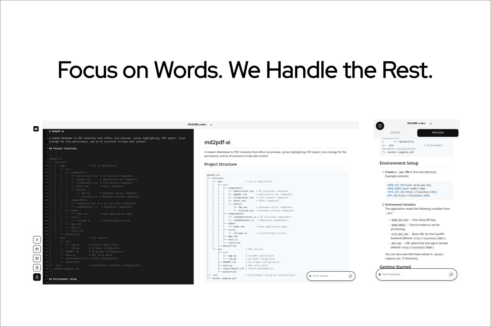

# md2pdf-ai

A modern Markdown to PDF converter that offers live preview, syntax highlighting, PDF export, local storage for file persistence, and an AI assistant to help edit content.




## Project Structure

```
md2pdf-ai/
├── services/
│   ├── app/                 # Vue.js application
│   │   ├── src/
│   │   │   ├── components/
│   │   │   │   ├── AiAssistant.vue  # AI assistant component
│   │   │   │   ├── AppBar.vue       # Application bar component
│   │   │   │   ├── Editor.vue       # CodeMirror markdown editor
│   │   │   │   ├── FileBrowser.vue  # File browser component
│   │   │   │   └── Preview.vue  # Markdown preview component
│   │   │   ├── composables/
│   │   │   │   ├── useAiAssistant.js # AI assistant composable
│   │   │   │   └── useWebSocket.js   # WebSocket composable
│   │   │   ├── pages/
│   │   │   │   └── Home.vue         # Main application page
│   │   │   ├── styles/
│   │   │   │   ├── style.css        # Main styles
│   │   │   │   └── custom/
│   │   │   │       ├── macos-frame.css      # macOS-style code block styling
│   │   │   │       └── markdown-preview.css # Markdown preview styles
│   │   │   ├── utils/
│   │   │   │   └── storage.js       # LocalStorage utility
│   │   │   ├── App.vue
│   │   │   └── main.js
│   │   └── Dockerfile
│   └── api/                 # API service
│       ├── src/
│       │   ├── app.py       # FastAPI application
│       │   └── llm.py       # AI model integration
│       ├── PROMPT.txt       # AI prompt configuration
│       ├── main.py          # API entry point
│       ├── requirements.txt # Python dependencies
│       └── Dockerfile
├── .env                     # Environment variables configuration
└── docker-compose.yml
```

## Environment Setup

1. **Create a `.env` file** in the root directory.  
   Example contents:

   ```env
   GROQ_API_KEY=your-groq-api-key
   GROQ_MODEL=your-model-name
   VITE_API_URL=http://localhost:8001
   APP_URL=http://localhost:8000
   ```

2. **Environment Variables**  
   The application reads the following variables from `.env`:

   * `GROQ_API_KEY` – Your Groq API key.
   * `GROQ_MODEL` – The AI model to use for processing.
   * `VITE_API_URL` – Base URL for the FastAPI backend (default `http://localhost:8001`).
   * `APP_URL` – URL where the Vue app is served (default `http://localhost:8000`).

   You can also override these values in `docker-compose.yml` if necessary.

## Getting Started

### Prerequisites

- Docker and Docker Compose

### Quick Start

1. **Clone the repository**:

   ```bash
   git clone https://github.com/zaqks/md2pdf-ai.git
   cd md2pdf-ai
   ```

2. **Start the application**:

   ```bash
   docker-compose up
   ```

3. **Open in browser**  
   Navigate to `http://localhost:8000`

## Original Reference

This project is based on the [md2pdf simplified version](https://github.com/realdennis/md2pdf), rewritten in Vue.js with enhanced features and modern tooling.

## License

MIT License – see [LICENSE](LICENSE) file for details.

## Contributing

Contributions are welcome! Please feel free to submit a Pull Request.

## Author

**zaqks** – [GitHub](https://github.com/zaqks)