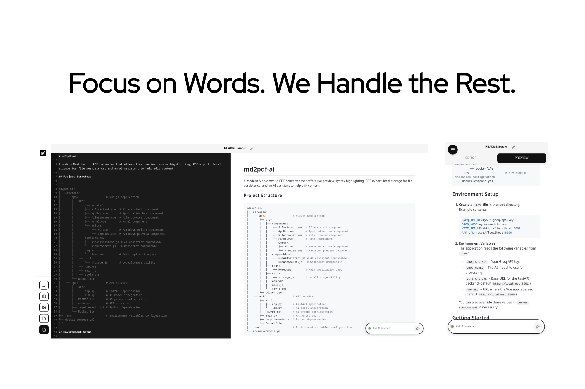

# md2pdf-ai

A modern Markdown to PDF converter with live preview, syntax highlighting, PDF export, cloud storage for easy document sharing, media storage for seamless image and file management, and an AI assistant to help edit content.




## Project Structure

```
md2pdf-ai/
├── services/
│   ├── app/                 # Vue.js application
│   │   ├── src/
│   │   │   ├── components/
│   │   │   │   ├── AiAssistant.vue   # AI assistant component
│   │   │   │   ├── AppBar.vue        # Application bar component
│   │   │   │   ├── AuthModal.vue     # Authentication modal
│   │   │   │   ├── CloudBrowser.vue  # Cloud document browser
│   │   │   │   ├── Editor.vue        # CodeMirror markdown editor
│   │   │   │   ├── FileBrowser.vue   # Local file browser component
│   │   │   │   ├── MediaBrowser.vue  # Media storage browser
│   │   │   │   └── Preview.vue       # Markdown preview component
│   │   │   ├── composables/
│   │   │   │   ├── useAiAssistant.js   # AI assistant composable
│   │   │   │   ├── useAuth.js          # Authentication composable
│   │   │   │   ├── useCloudStorage.js  # Cloud storage composable
│   │   │   │   └── useWebSocket.js     # WebSocket composable
│   │   │   ├── pages/
│   │   │   │   └── Home.vue          # Main application page
│   │   │   ├── styles/
│   │   │   │   ├── style.css         # Main styles
│   │   │   │   └── custom/
│   │   │   │       ├── macos-frame.css      # macOS-style code block styling
│   │   │   │       └── markdown-preview.css # Markdown preview styles
│   │   │   ├── utils/
│   │   │   │   └── storage.js        # LocalStorage utility
│   │   │   ├── App.vue
│   │   │   └── main.js
│   │   └── Dockerfile
│   └── api/                 # API service
│       ├── src/
│       │   ├── routes/
│       │   │   ├── __init__.py
│       │   │   ├── auth.py       # Authentication endpoints
│       │   │   ├── documents.py  # Document CRUD endpoints
│       │   │   └── media.py      # Media upload/management endpoints
│       │   ├── app.py            # FastAPI application
│       │   ├── auth.py           # Authentication logic
│       │   ├── database.py       # Database connection and models
│       │   ├── dependencies.py   # Dependency injection
│       │   ├── llm.py            # AI model integration
│       │   ├── models.py         # SQLAlchemy models
│       │   └── schemas.py        # Pydantic schemas
│       ├── PROMPT.txt       # AI prompt configuration
│       ├── main.py          # API entry point
│       ├── requirements.txt # Python dependencies
│       └── Dockerfile
├── .env                     # Environment variables configuration
└── docker-compose.yml
```

## Environment Setup

1. **Create a `.env` file** in the root directory.  
   Example contents:

   ```env
   # AI Configuration
   GROQ_API_KEY=your-groq-api-key
   GROQ_MODEL=llama-3.3-70b-versatile
   
   # API Configuration
   VITE_API_URL=http://localhost:8001
   APP_URL=http://localhost:8000
   
   # Database Configuration
   DATABASE_URL=sqlite:///./md2pdf.db
   ```

2. **Environment Variables**  
   The application reads the following variables from `.env`:

   **AI Configuration:**
   * `GROQ_API_KEY` – Your Groq API key.
   * `GROQ_MODEL` – The AI model to use for processing (default: `llama-3.3-70b-versatile`).

   **API Configuration:**
   * `VITE_API_URL` – Base URL for the FastAPI backend (default `http://localhost:8001`).
   * `APP_URL` – URL where the Vue app is served (default `http://localhost:8000`).

   **Database Configuration:**
   * `DATABASE_URL` – Database connection string (default: SQLite database).

   You can also override these values in `docker-compose.yml` if necessary.

## Getting Started

### Prerequisites

- Docker and Docker Compose

### Quick Start

1. **Clone the repository**:

   ```bash
   git clone https://github.com/zaqks/md2pdf-ai.git
   cd md2pdf-ai
   ```

2. **Start the application**:

   ```bash
   docker-compose up
   ```

3. **Open in browser**  
   Navigate to `http://localhost:8000`

## Original Reference

This project is based on the [md2pdf simplified version](https://github.com/realdennis/md2pdf), rewritten in Vue.js with enhanced features and modern tooling.

## License

MIT License – see [LICENSE](LICENSE) file for details.

## Contributing

Contributions are welcome! Please feel free to submit a Pull Request.

## Author

**zaqks** – [GitHub](https://github.com/zaqks)